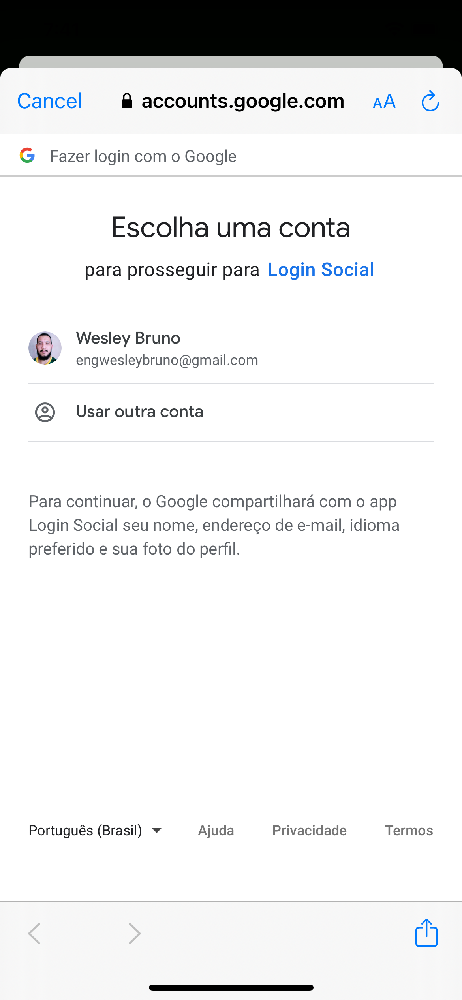

<h1 align="center">
  
</h1>

<p align="center">
  <a href="#page_with_curl-sobre">Sobre</a>&nbsp;&nbsp;&nbsp;|&nbsp;&nbsp;&nbsp;
  <a href="#hammer-iniciando-mobile">Tecnologias</a>
  &nbsp;&nbsp;&nbsp;|&nbsp;&nbsp;&nbsp;
  <a href="#books-requisitos">Requisitos</a>&nbsp;&nbsp;&nbsp;|&nbsp;&nbsp;&nbsp;
  <a href="#rocket-começando">Começando</a>&nbsp;&nbsp;&nbsp;
</p>

<h1 align="center">
  &nbsp;&nbsp;
  
</h1>

## :page_with_curl: Sobre

Aplicação desenvolvida para teste de autenticação via login social com as contas Google e Apple.

## :hammer: Tecnologias

Para a construção da aplicação, foram utilizadas as seguintes tecnologias:

- [React Native](https://reactnative.dev/)
- [Expo](https://expo.io/)
- [TypeScript](https://www.typescriptlang.org/)
- [React Navigation](https://reactnavigation.org/)

## :rocket: Requisitos

- Ter [**Git**](https://git-scm.com/) para clonar o projeto.
- Ter [**Node.js**](https://nodejs.org/en/) instalado.
- Um dispositivo ou emulador iOS ou Android

## :rocket: Começando

```bash
  # Clonar o projeto:
  $ https://github.com/brunowbbs/Login-Social-React-Native.git

  # Entrar no diretório:
  $ cd pokedex

  # Instalar as dependências:
  $ yarn
```

## :iphone: Executando

```bash
  # Iniciar a aplicação:
  $ expo start || yarn ios || yarn android
```

Feito por Wesley Bruno 👋🏻 [Get in touch!](https://github.com/brunowbbs)
